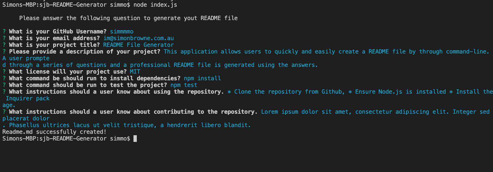

# sjb-README-Generator

##  Description
This application allows users to quickly and easily create a README file by through command-line. A user prompted through a series of questions and a professional README file is generated using the answers. 

Questions 
* What is your GitHub Username?
* What is your email address?
* What is your project title?
* Please provide a description of your project?
* What license will your project use?
* What command be should run to install dependencies?
* What command should be run to test the project?
* What instructions should a user know about using the repository.
* What instructions should a user know about contributing to the repository.

## User Story

```md
AS A developer
I WANT a README generator
SO THAT I can quickly create a professional README for a new project
```

## Installation 
* Clone the repository from [Github](git@github.com:simmmmo/sjb-README-Generator.git)
* Ensure Node.js is installed
* Install [Inquirer package](https://www.npmjs.com/package/inquirer)


## Usage 
Run 
```bash
node index.js
```
Follow the prompted questions. 

Example of command line inputs




## Output 
Example of generated README file. Generated README file is saved to ./output folder


## Project Links

* Repo name

sjb-README-Generator

* GitHub enviroment

https://github.com/simmmmo/sjb-README-Generator/tree/main

git@github.com:simmmmo/sjb-README-Generator.git
